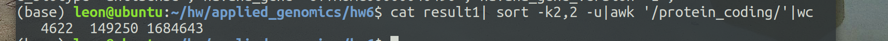
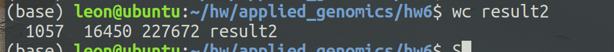
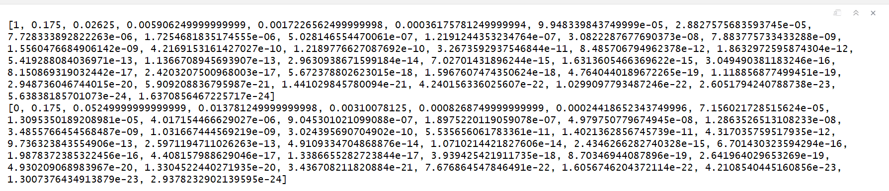
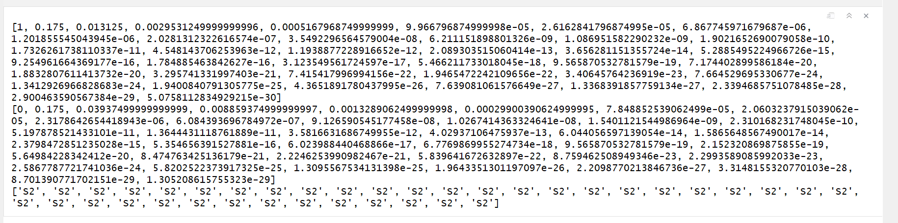
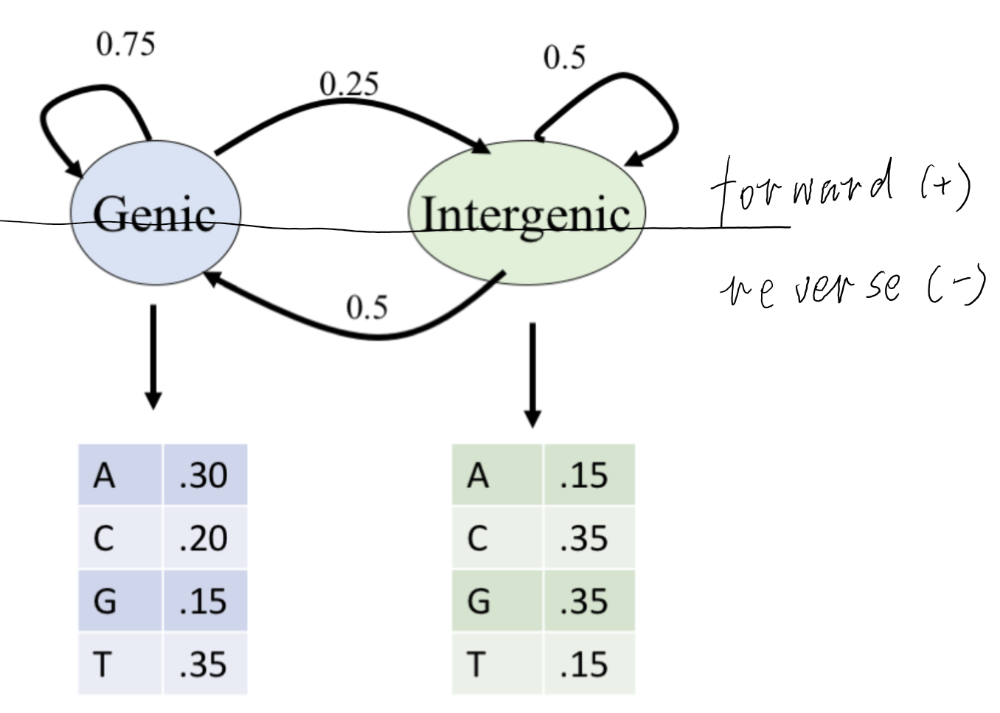
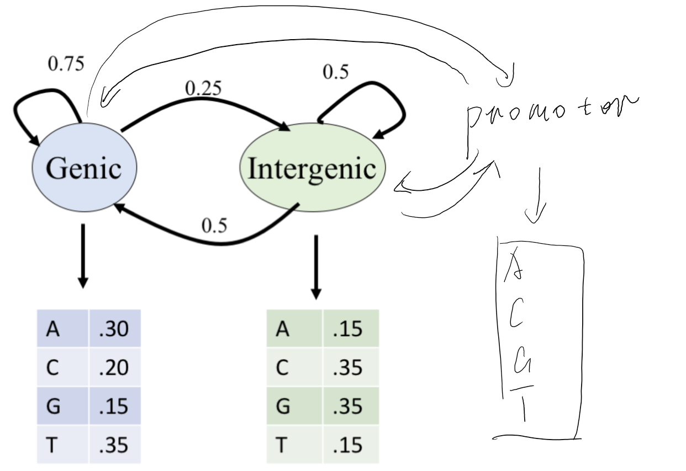

---
output:
  pdf_document: default
  html_document:
    self_contained: no
---

## Q1.a

R code:  

```
library(openxlsx)
a = c('Chromosome','Start','End')
b = read.xlsx('npjgenmed201627-s3.xlsx',sheet=4,startRow = 2)
c = b[a]
d = cbind(c[1],c[2],c[3]+1)
write.table(d,'q1.bed',sep='\t',row.names = F,col.names = F,quote = F)
```  

Upload to https://genome.ucsc.edu/cgi-bin/hgLiftOver, download the bed file

Delete the commented line and then shell code:  

```
sed 's/^/chr/' Homo_sapiens.GRCh38.87.gtf > Homo_sapiens.GRCh38.87_result.gtf
bedtools intersect -a hglft_genome_5706_29fbb0.bed -b Homo_sapiens.GRCh38.87_result.gtf -wa -wb 
  > result1
cat result1| sort -k2,2 -u|awk '/protein_coding/'|wc
```  
  
So we have 4622 variants in protein coding genes.

\pagebreak


## Q1.b  

Similar process as shown in 1a, preprocess the homo_sapiens file (sed 's/^/chr/') and then:  


```
bedtools intersect -a hglft_genome_5706_29fbb0.bed 
  -b homo_sapiens.GRCh38.Regulatory_Build.regulatory_features.20161111_result.gtf -wa -wb 
  > result2
wc result2
```  
  
So 1057 variants are in annotated regulatory regions.

\pagebreak

## Q1.c    

  
So open chromatin region has the most variants.

\pagebreak

## Q1.d  

Essentially we need to test if those variants in annotated regulatory region are uniformly distributed, so we use chi-square test:  

```{r}
chisq.test(c(241,303,100,93,274,46))
```

p-value < 0.05, meaning they are not randomly distributed. In this case, it's enriched.
\pagebreak

## Q2.a 

```{r}
#tsne
library(Rtsne)
library(ggplot2)
library(plotly)
set.seed(101)
dat = as.matrix(read.table('expression.txt',row.names = 1,header = T))
tsne = Rtsne(dat)
# plot(tsne$Y, asp =1 ,main="tSNE", xlab="tSNE dimension 1", ylab="tSNE dimension 2")
ggplot(as.data.frame(tsne$Y),aes(x=V1,y=V2))+
  geom_point()+labs(x= 'tsne 1', y = 'tsne 2', title = 'tsne')
```  


\pagebreak


## Q2.b  


```{r}
library(umap)
library(plotly)
set.seed(102)
dat = as.matrix(read.table('expression.txt',row.names = 1,header = T))
umap = umap(dat)
ggplot(as.data.frame(umap$layout),aes(x = V1,y=V2))+
  geom_point()+labs(x= 'umap 1', y = 'umap 2', title = 'umap')
```
\pagebreak

## Q2.c  

```{r}
#pca
library(plotly)
set.seed(101)
dat = as.matrix(read.table('expression.txt',row.names = 1,header = T))
pca = prcomp(t(dat))
ggplot(as.data.frame(pca$rotation),aes(x=PC1,y=PC2))+
  geom_point()+labs(title = 'pca')
```


```{r}
#time comparison and heatmap
ptm <- proc.time()
tsne = Rtsne(dat)
proc.time() - ptm

ptm <- proc.time()
umap = umap(dat)
proc.time() - ptm

ptm <- proc.time()
pca = prcomp(t(dat))
proc.time() - ptm

ptm <- proc.time()
heatmap(dat)
proc.time() - ptm
```


From results shown above, PCA is the fastest and umap is the slowest. Heatmap is pretty easy to understand and straightforward. For t-sne and umap, the relative positions of clusters are not fixed. 

\pagebreak

## Q3.a  

```{python}
s1 = [1] 
s2 = [0] 
seq = 'CAACATTGTCGCCATTGCTCAGGGATCTTCTGAACGCTC'
dic1 = {'A':0.15,'C':0.35,'G':0.35,'T':0.15}
dic2 = {'A':0.3,'C':0.2,'G':0.15,'T':0.35}
#forward
for i in range(len(seq)):
    s1.append(float(s1[i])*0.5*dic1[seq[i]] + float(s2[i])*0.25*dic2[seq[i]])
    s2.append(float(s1[i])*0.5*dic1[seq[i]] + float(s2[i])*0.75*dic2[seq[i]])
print(s1)
print(s2)
```

Trellis:  
  
So probability = 1.6370856467225717e-24.  

\pagebreak

## Q3.b  


```{python}
s1 = [1]                                                                                            
s2 = [0] 
seq = 'CAACATTGTCGCCATTGCTCAGGGATCTTCTGAACGCTC'
dic1 = {'A':0.15,'C':0.35,'G':0.35,'T':0.15}
dic2 = {'A':0.3,'C':0.2,'G':0.15,'T':0.35}
#forward
for i in range(len(seq)):
    s1.append(float(s1[i])*0.5*dic1[seq[i]] + float(s2[i])*0.25*dic2[seq[i]])
    s2.append(float(s1[i])*0.5*dic1[seq[i]] + float(s2[i])*0.75*dic2[seq[i]])
#print(s1)
#print(s2)
#viterbi
s3 = []
s1 = [1] 
s2 = [0] 
for i in range(len(seq)):
    s12s1 = float(s1[i])*0.5*dic1[seq[i]]
    s22s1 = float(s2[i])*0.25*dic2[seq[i]]
    s12s2 = float(s1[i])*0.5*dic1[seq[i]]
    s22s2 = float(s2[i])*0.75*dic2[seq[i]]
    s1.append(max(s12s1,s22s1))
    s2.append(max(s12s2,s22s2))
    if s1[i] > s2[i]:
        s3.append('S1')
    else:
        s3.append('S2')
print(s1)
print(s2)
print(s3[1:])
```

Trellis:  
  
In this case, S2 represents genic state. 

\pagebreak

## Q3.c

Just split the model into two parts and assign emission probability and transition probability as needed for each strand(sort of symmetric):  



\pagebreak

## Q3.d  

Add another state and assign emission probability and transition probability as shown below:  

